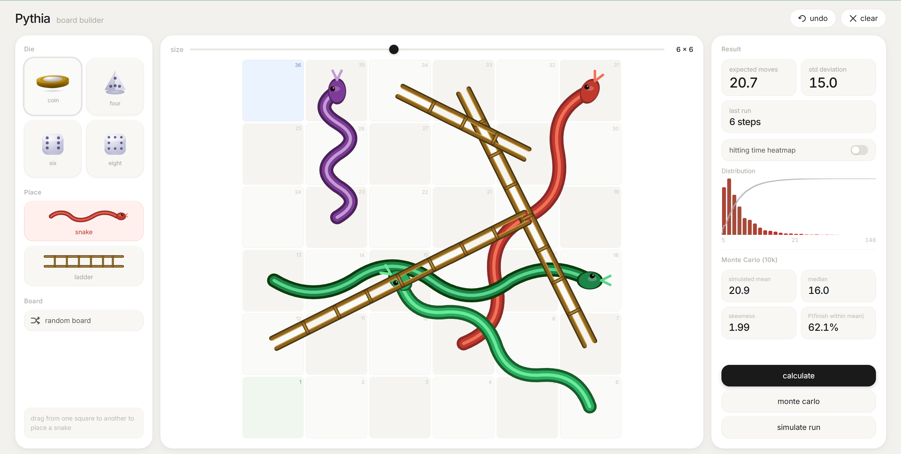

# Pythia
Snakes and Ladders solver

 

  

  <em>Pythia preview</em>

## Overview

I had a module in final year which used Markov chains to solve a toy snakes and ladder game, I thought it would be an interesting idea to expand that to larger and more complex boards. The code behind this ended up being completely different to the math I learned in college so that background didn't help at all. The outcome is an intuitive board designer with interesting statistical outputs and nice animations.
